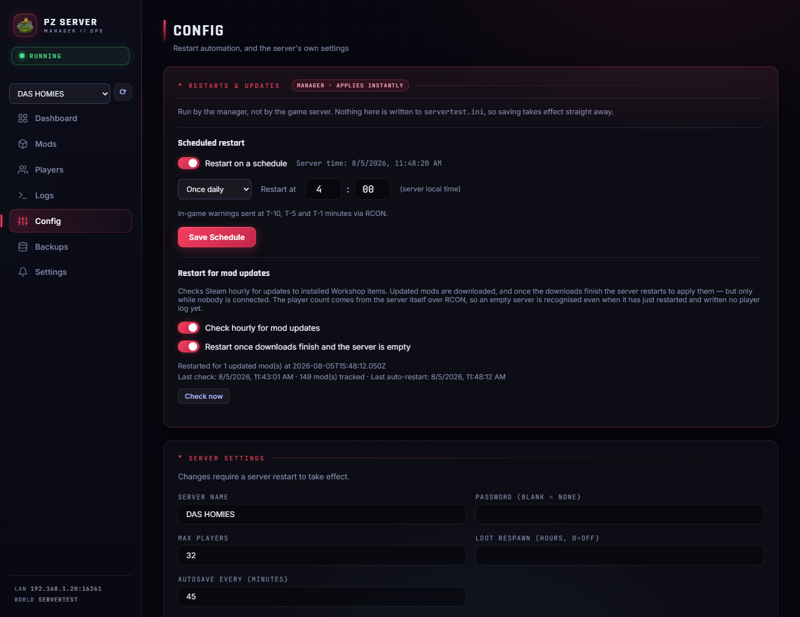
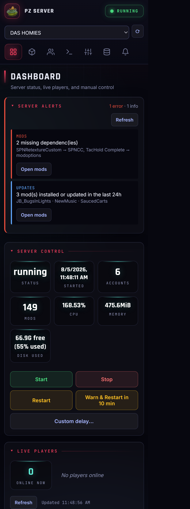
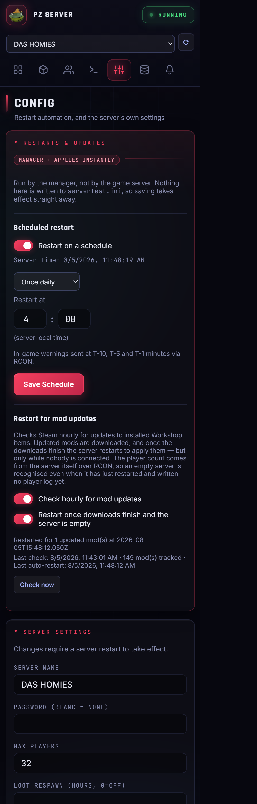
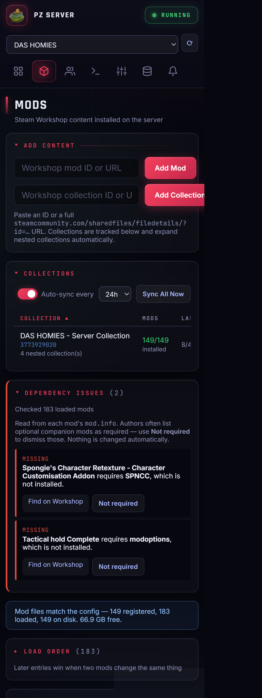
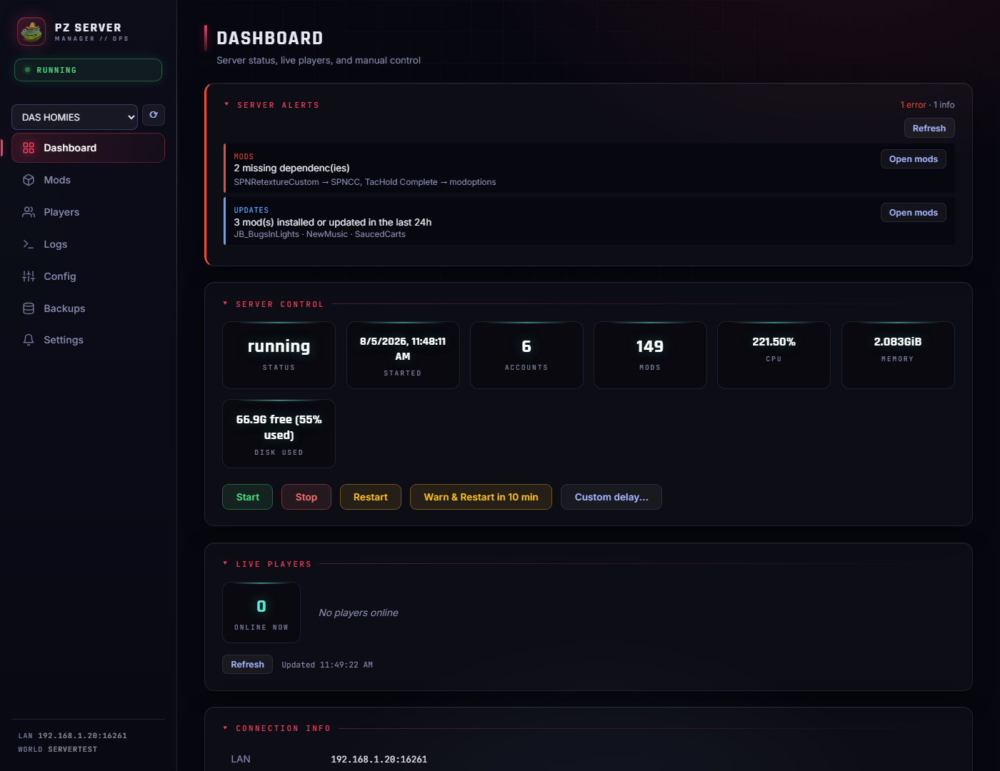
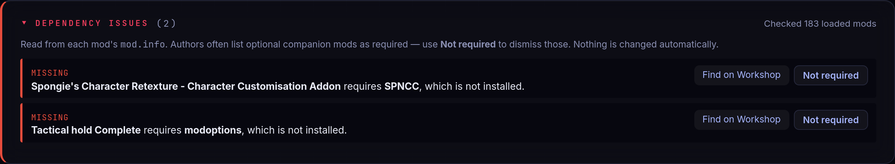
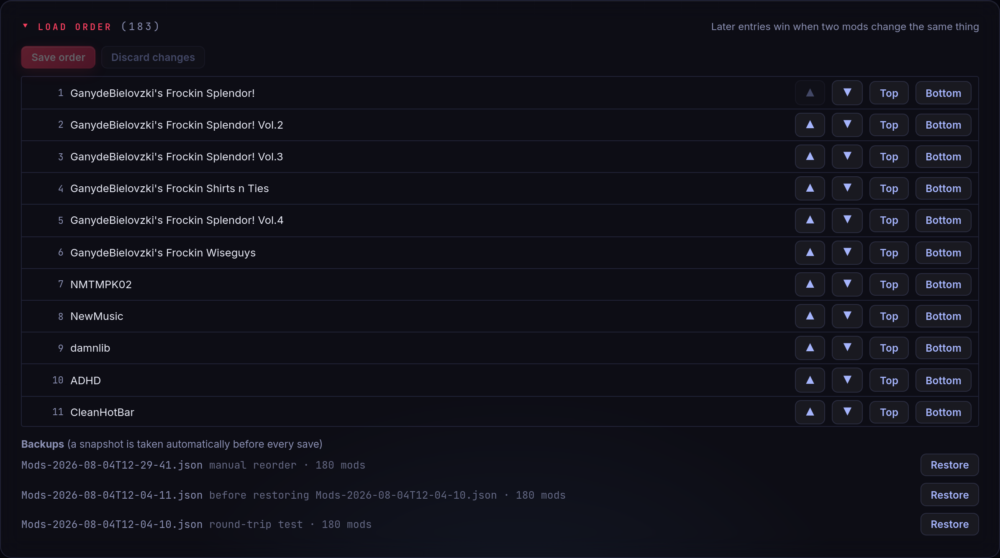
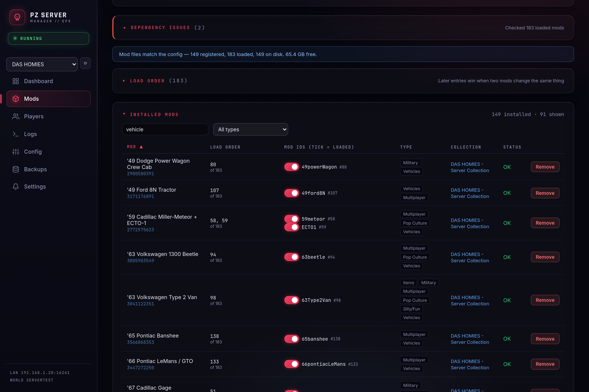
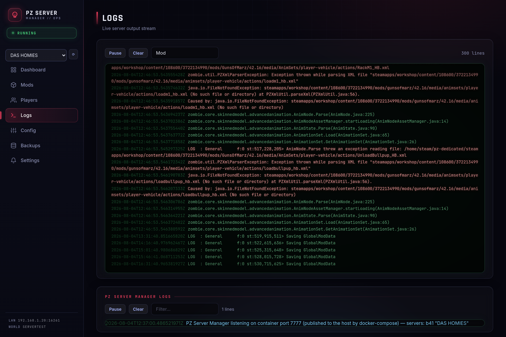

# PZ Server Manager

Web-based management UI for a Project Zomboid dedicated server running in Docker.

Built with Node.js + Express. Runs as a sidecar Docker container alongside the PZ server container.

## Features

- **Dashboard** — server status, live player count, every manual action (Start / Stop / Restart, warned restarts), CPU / Memory / Disk stats
- **Config** — **Restarts & Updates** in one place at the top, then the server's own `servertest.ini` settings and sandbox options
- **Mods** — install mods by Steam Workshop ID, remove mods, live download progress tracking
- **Players** — whitelist management, access level control, ban/unban
- **Logs** — live streaming server logs with filter and keyword coloring
- **Settings** — Pushover push notifications and Discord status card
- **Works on a phone** — the whole UI is usable at 390px, so a restart can be scheduled or a mod added from bed

### Restarts & Updates

Both ways the server restarts itself are one card at the top of **Config**, deliberately styled apart from
everything below it: those write `servertest.ini` and need a restart to take effect, while these are the
manager's own settings and apply the moment they are saved.

| | |
|---|---|
| **Scheduled restart** | Daily at a set time, or every N hours. In-game warnings at T-10, T-5 and T-1 via RCON. |
| **Restart for mod updates** | Checks Steam hourly, downloads what changed, and restarts to apply it — but only while nobody is connected. |

The player count comes from the server itself over RCON rather than from the PZ user log. PZ writes that log
lazily, on the first connection of a session, so an empty server that has just restarted has no log at all —
which used to read as "cannot tell" and blocked the restart forever, exactly when it should have fired.

The schedule runs on the manager container's wall clock, so set `TZ` (see Setup) or 4:00 means 4:00 UTC.

### Notification events

| Event | Description |
|---|---|
| Server start / stop / restart | Fires on UI action |
| Server crash | Background poll — detects unexpected container exit |
| Low disk space | Alerts when free space drops below configurable threshold |
| Workshop downloads complete | Fires when mod update queue drains to zero |
| Player joined | Parsed from PZ user log |
| Player left | Parsed from PZ user log |
| Player died | Parsed from PZ user log |
| Player kicked | Parsed from PZ user log |

## Screenshots

Captured from a live server running 149 Workshop items / 183 loaded mods.

### Restarts & Updates

The scheduled restart and the mod-update restart, together at the top of Config. The badge and the accent
border are the point: everything below this card is a PZ setting, and nothing in it is.



### On a phone

Same UI, no separate mobile build. The sidebar becomes a top bar with a scrollable tab strip, two-column
forms collapse to one, stat tiles pack three across, and wide tables scroll inside their card instead of
dragging the page sideways.

| Dashboard | Restarts & Updates | Mods |
|---|---|---|
|  |  |  |

### Dashboard — Server Alerts

Mod issues, orphaned files, failed downloads, recent updates and notable errors from both log streams, gathered in one place. Every manual server action lives here too — including the warned restarts, which used to be buried in the restart schedule.



### Dependency issues

`require=`, `incompatible=` and `loadModAfter=` read from every installed `mod.info` and checked against `Mods=`. Nothing is auto-installed — authors list optional companions as required all the time, so each row asks.



### Load order

Reorder `Mods=` directly. Moves are staged locally and written only on save, and the previous order is snapshotted automatically before every save.



### Installed mods

Per-mod-id enable toggles, load position, Workshop type tags, and collection attribution. A Workshop item shipping several mod ids shows every position it occupies.



### Logs

The PZ server log and the manager's own log as separate streams, each with independent pause, clear and filter.



## Requirements

- Docker with access to the host socket (`/var/run/docker.sock`)
- PZ server container named `zomboid`
- PZ data volume mounted at `/pz-data`
- PZ workshop volume mounted at `/workshop`

## Setup

Add to your existing PZ `docker-compose.yml`:

```yaml
services:
  mod-manager:
    build: ./mod-manager
    container_name: pz-mod-manager
    ports:
      - "7777:7777"
    volumes:
      - /var/run/docker.sock:/var/run/docker.sock
      - ./workshop:/workshop
      - ./data:/pz-data
    environment:
      - TZ=America/New_York
    restart: unless-stopped
    depends_on:
      - zomboid
```

Set `TZ` to your own zone. The scheduled restart runs on this container's wall clock, so
without it a schedule of 8:00 fires at 8:00 **UTC** — 4am if you are on US Eastern — and the
dashboard's "Server time" reads UTC to match. Use a named zone rather than `EST`: named zones
follow daylight saving, so 8:00 stays 8:00 in July.

Copy the `mod-manager/` directory into your PZ compose project, then:

```bash
docker compose build mod-manager
docker compose up -d mod-manager
```

Open `http://<server-ip>:7777`.

## Notifications

Configure Pushover credentials in the **Settings** tab of the UI. Credentials are stored in `/pz-data/notifications.json` (your data volume) — they are never baked into the image.

Get a Pushover account and app token at [pushover.net](https://pushover.net).

## File layout

```
mod-manager/
  Dockerfile
  package.json
  server.js        # Express API + background monitors
  public/
    index.html     # Single-page UI (vanilla JS, no build step)
```

## Notes

- The PZ server container must be named `zomboid` (or update `server.js`)
- Server config expected at `/pz-data/Server/servertest.ini`
- Whitelist DB at `/pz-data/db/servertest.db` (SQLite)
- Player event logs at `/pz-data/Logs/*_user.txt` (PZ B41 format)
- Workshop content at `/workshop/content/108600/`
- When installing mods via UI, SteamCMD downloads to `pz-dedicated/` dir inside the PZ container — manager copies to the mounted Steam workshop path automatically

## License

MIT
